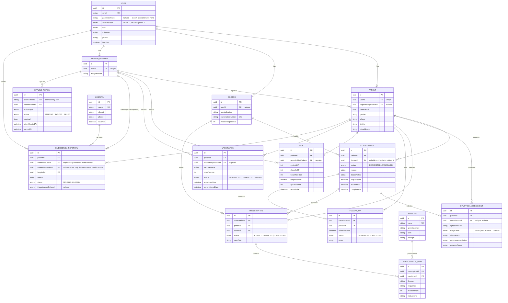

# ArogyaX — ER Diagram

This diagram mirrors `prisma/schema.prisma` exactly. If the schema changes,
update this diagram in the same commit.

## Notes on this revision

- Medicine substitution fields on `PRESCRIPTION_ITEM` have been removed —
  they are not part of the current MVP.
- `EMERGENCY_REFERRAL` now has two possible creator relationships:
  `createdByUserId` (always populated, works for Patient or Health Worker)
  and `createdByWorkerId` (populated only when a Health Worker was the
  creator, kept for worker-specific reporting).
- `VITAL.recordedByWorkerId` and `VACCINATION.recordedByWorkerId` are now
  required (solid line, not optional) — the current MVP has no patient
  self-recording workflow for either.
